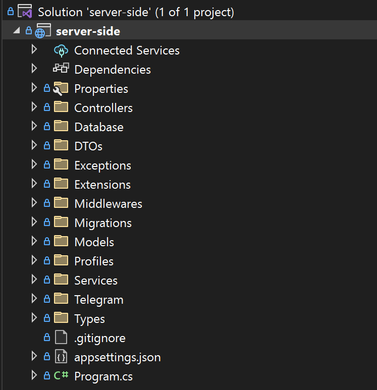
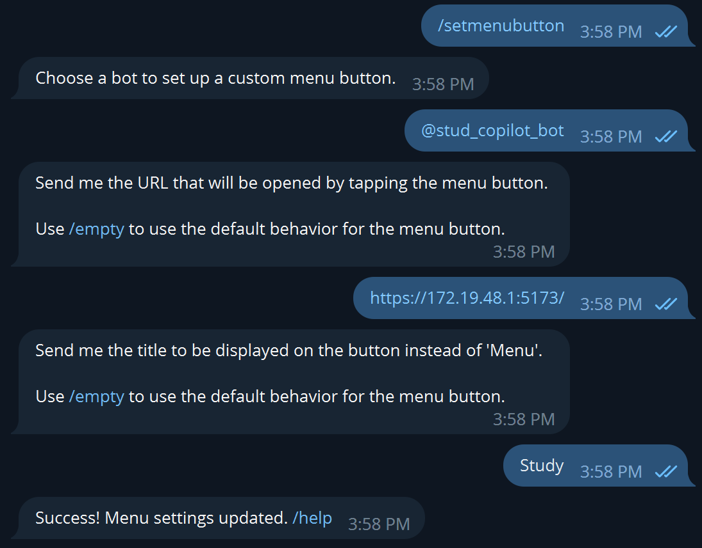
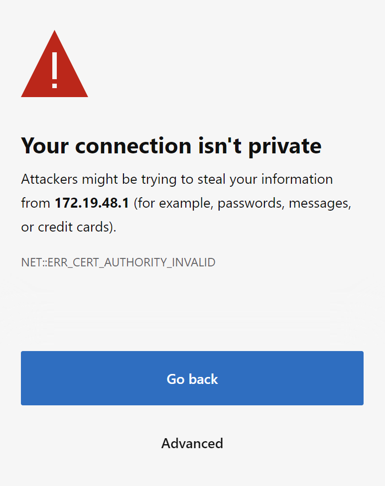
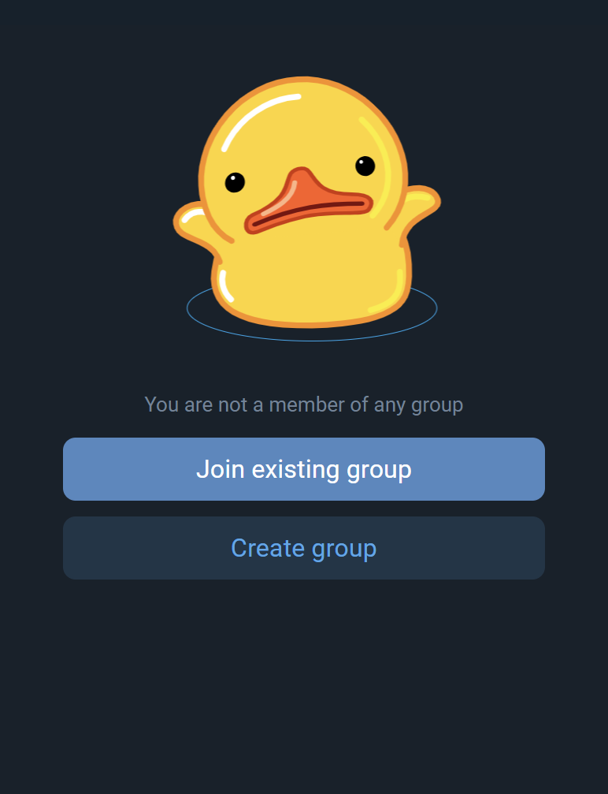

# Student Copilot (Telegram Mini-app contest)

This is repository of Student Copilot, my solve of Telegram Mini-app contest. Here is a step-by-step guide,
which describes how to setup local environment for running this mini-app locally on your machine.

### For what this mini-app? (Breathtaking message)

While studying in university I've faced up with big problem. My classmates and I needed to cope with recording assigned hometasks by using not very convenient services. So this mini-app provides simple interface for creating student groups, subjects, links and also hometasks. 

Why as a Telegram mini-app? Nowadays Telegram stores a lot of information, connected with studying (groups with teachers, announcement channels, etc.), and (from my point of view) this mini-app would be really interesting addition for all of this educational stuff.

### How to test this by yourself without code?

You can test my solution in [Student Copilot bot](https://t.me/stud_copilot_bot). Open it and press **"Study"** button to open mini-app. Than you can do whatever you want)

### Documentation table of contents
 - [API documentation](./docs/api-docs.md)
 - [UI documentation](./docs/ui-docs.md)

### Technologies
 - **Server-side**: .NET 7 (Web-API, REST API)
 - **Database**: MySQL, Planetscale (server)
 - **Client-side**: Vite (React)

# Dictionary of concepts
 - **group** - a group of users, which are united according to some characteristic *(e.g. class)*
 - **link** - a link to important or usefull internet resource *(e.g. link to Github organization)*
 - **subject** - a school subject for which homework may be assigned *(e.g. Programming, Maths)*
 - **hometask** - assigned hometask *(e.g. Solve #1, #2, #3... from Maths Student`s book)*
# Step-by-step setup guide

Pull this repository to your local machine:
```console
> git pull git@github.com:Kononenko-Daniil/telegram-mini-app-contest.git
```

### Bot setup

Create your bot with [@BotFather](https://t.me/BotFather). Copy new bot **API Token**.
### Database setup

Create MySQL database. You can do this locally using **MySQL Workbench.**

Or *(recommended variant)* to do this with remote database service. I have used [Planetscale](https://planetscale.com/). It provides a sufficient number of free resources (1 **billion** row reads and 10 **million** row writes).

After you have created MySQL database, get its connection string, which we will use in .NET 7 configuration *(appsettings.json file)*. Your database connection JSON block shoud look like this:

```json
{
  "ConnectionStrings": {
    "Default": "Server=<...>;Database=<...>;user=<...>;password=<...>;SslMode=<...>;"
  },
}
```

### Server side setup

Open **server-side** solution with Visual Studio *(recomended)*, Rider or any other IDE. 

Create *appsettings.json* file in **server-side** project. Your solution structure should look like this:



Open *appsettings.json* file and add this JSON code to it:

``` json
{
  "Logging": {
    "LogLevel": {
      "Default": "Information",
      "Microsoft.AspNetCore": "Warning"
    }
  },
  "AllowedHosts": "*",
  "TelegramBotConfiguration": {
    "Token": "<YOUR BOT TOKEN>"
  },
  "ConnectionStrings": {
    "Default": "<YOUR DEFAULT CONNECTION STRING>"
  }
}
```

Than open **Package Manager Console** and apply migrations to your database:

```console
> Update-Database
```

And that's it! Now you can run your **Web-API project**. After running it will open **Swagger** page in browser.

### Client-side setup

Now we can go to setuping **client-side** project.

Open **client-side** project with **Visual Studio Code** *(recomended)*. Than open console and run install command:

``` console 
> npm install
```

Than go to */src/Constants.js* file and input **production** and **development** API URL (if you are working only locally, fill free to pass **development** API URL to production configuration).

*You can find API URL by running your .NET 7 app, or in server-side/Properties/launchSettings.json*

**Warning! You need to pass API URL in format: "https://localhost:3456" (without last '/', or you will face up with Errors)**

### Running it all together

Run your **server-side** project.

Now you need to run your **client-side** project:
```
npm run dev --host
```

And you will see something like this:
```
Local: url...
Network: url...
Network: url...
```

Copy one of the **Network** URLs. Than go back to [@BotFather](https://t.me/BotFather) and run **/setmenubutton**. Than choose your bot. Insert copied UI URL. Provide name to *Menu* button.



Now go to your bot and press *Menu* button. You will see something like this:



Press *Advanced* and than *Continue*. And that's it! You will see something like this:



